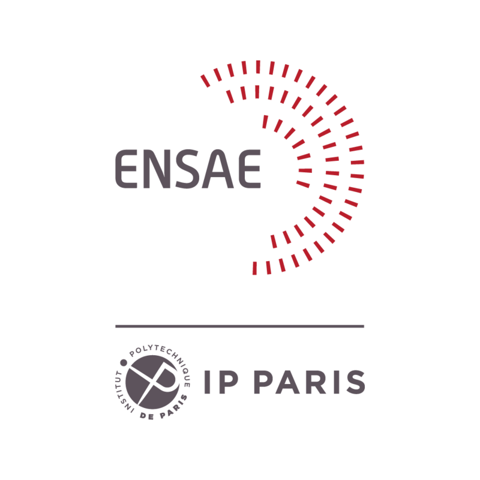

# Optimal-Transport-Project-3A-ENSAE
<p align="center">
  <a href="" rel="noopener">
 </a>
</p>

<h3 align="center">A Specialized Semismooth Newton Method for Kernel-Based
Optimal Transport</h3>

<div align="center">

[]()
[](/LICENSE)

</div>

---


## 📝 Table of Contents

- [About](#about)
- [Installing](#Installing)
- [Code description](#Code description)

##  About <a name = "about"></a>
This project describes an implementation of semismooth Newton (SSN) method for kernel-based optimal transport (OT).The aim of this project is to
implement a Specialized Semismooth Newton Method (SSN) for Kernel-Based Optimal Transport,
which was introduced by Lin et al. [2024]. After initially implementing the algorithm primarily using numpy, we attempted to re-implement
it in JAX.


## Installing <a name = "Installing"></a>

To ensure you have all the libraries used in our simulations, refer to the [requirements.txt](requirements.txt) file. Use the following command to install any missing libraries:

```
pip install -r requirements.txt
```


##  Code description <a name = "Code description"></a>

The main code of this project is orginized in two notebooks. The first one, 


## ✍️ Authors <a name = "authors"></a>

- [@Valentin](https://github.com/Tordjx) 
- [@Ambre](https://github.com/ambree14) 
- [@Ilyes](https://github.com/ilyeshammouda) 


## References <a name = "References"></a>
- C.Zhu,W.R.Huang,A.Shafahi,H.Li,G.Taylor,C.Studer,T.Goldstein. [Transferable Clean-Label Poisoning Attacks on Deep Neural Nets](https://doi.org/10.48550/arXiv.1905.05897): [arXiv:1905.05897v2](https://doi.org/10.48550/arXiv.1905.05897)
- K.He, X.Zhang,S.Ren,J.Sun. [Deep Residual Learning for Image Recognition](https://doi.org/10.48550/arXiv.1512.03385): [	arXiv:1512.03385 ](
https://doi.org/10.48550/arXiv.1512.03385)
- Z.Zhou, M.R.Siddiquee,N.Tajbakhsh, J.Liang. [UNet++: A Nested U-Net Architecture for Medical Image Segmentation](https://doi.org/10.48550/arXiv.1807.10165): [arXiv:1807.10165v1 ](
https://doi.org/10.48550/arXiv.1807.10165
)
